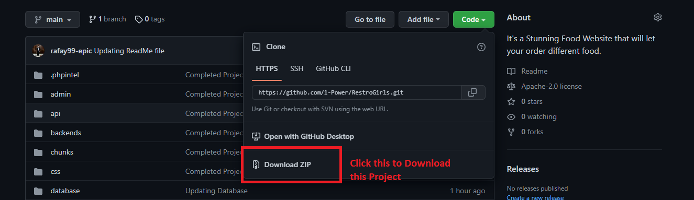
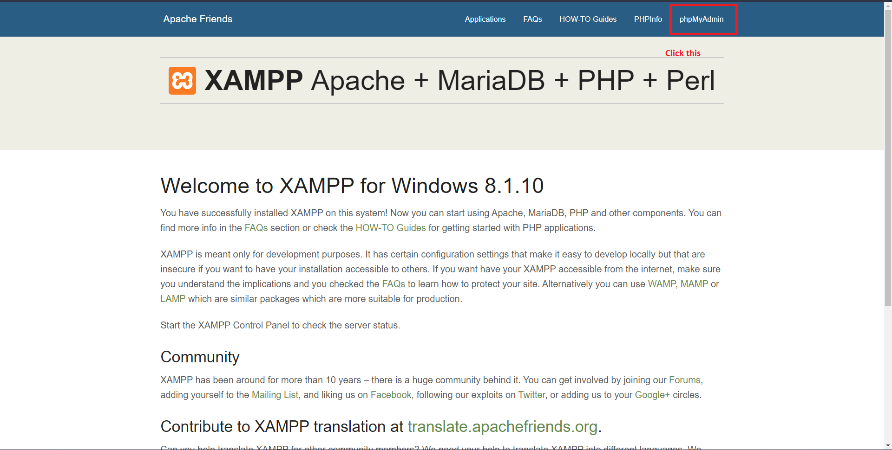
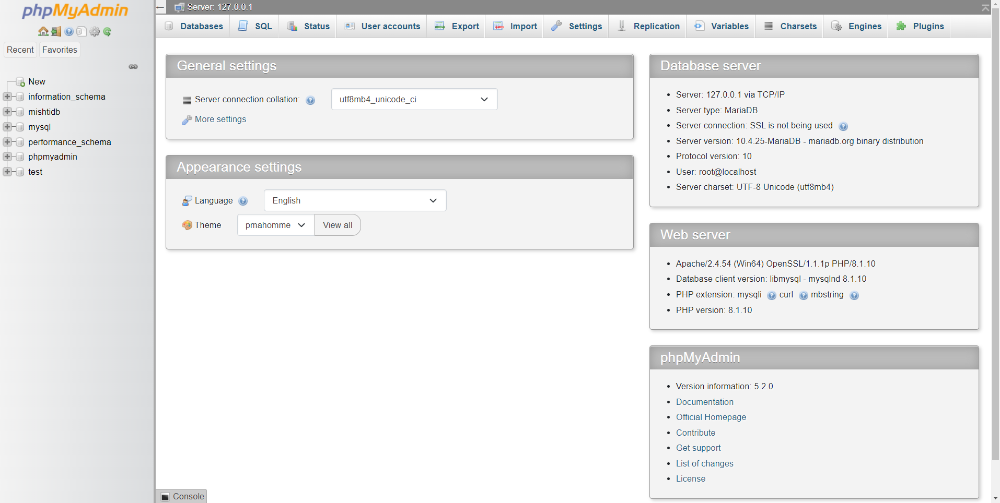
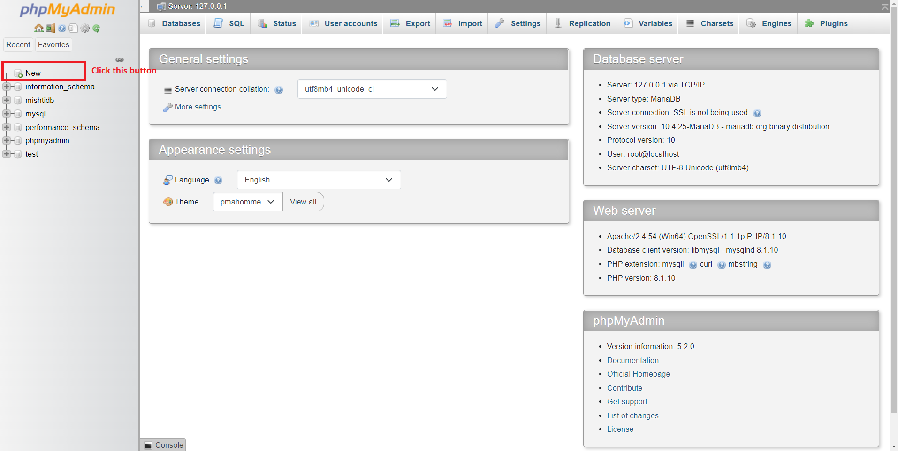
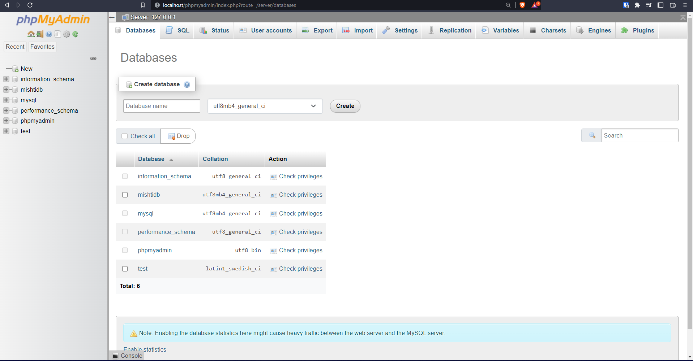
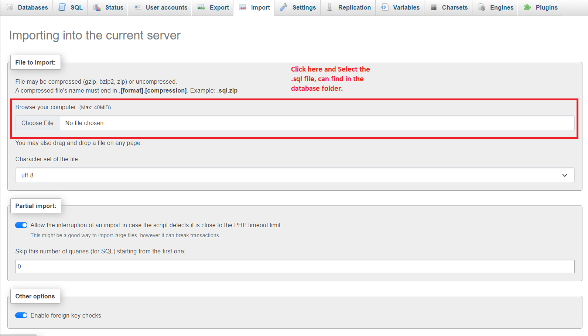
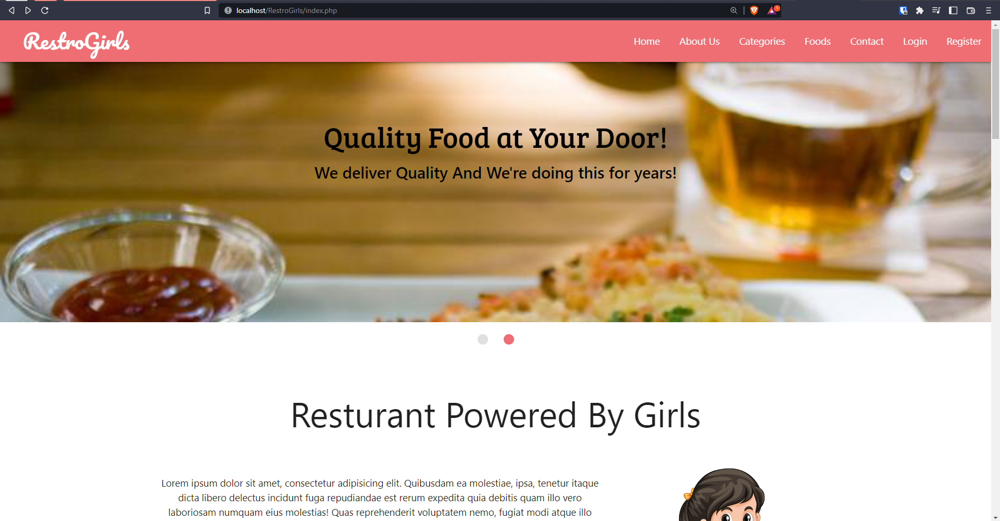
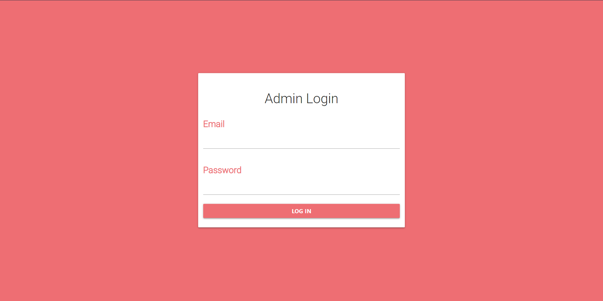

# RestroGirls
## Introduction
In this repository you can find stunning looking website. The core idea of this website is ststaed bellow:

## Theme:
The main theme of this website is that the website is designed for girls so the the will be in white and pink color stage. 

## Coding Language:
The website using multiple programming languages such as PHP, MySQL, HTML and CSS. More languages can be found and you can find them on github.

## License
The website is licensed under MIT license, see [LICENSE](./LICENSE)

## Installment Methods:
### Installing Application:
In ordor to run the application on your system you need to a couple applications:
1. Install [xampp](https://www.apachefriends.org/download.html)
2. Install [VS Code](https://code.visualstudio.com/download)

## Steps:
### Cloning the Project: 
There are two ways to get the project 
1. Clone the project using git and Terminal
2. Download the project from github by pressing the download button.

#### Clone the Project Using Git:
1. Download [Git](https://git-scm.com/downloads) if needed.
2. Install the Git on your system.
3. Once installed then open your Termial.
4. Redirect to the download Directory.
5. Once you are in the Download Directory then enter the following command:
```
git clone https://github.com/1-Power/RestroGirls.git
```
6. Once your Project is cloned on your system then move forward to the next step.

#### Downlod Project using Download Project:
1. Go the Github [repository](https://github.com/1-Power/RestroGirls.git)
2. Once you are on the repo then press the following button as shown in the image bellow:

3. Once the button is click then the Project will start to download.

### Running Xammpp on your system & Importing Database
1. Once all your applications are installed then run xampp. 
2. Once the xampp is running then click start on the first two options as show in the bellow image.

3. Once the server is running then open Browser of your choice.
4. Open the browser of your choice isopen then on the search bar type the following: 
```
localhost 
```
5. When you enter the above command then you will be redirected to the myphpadmin website. It will look like this as shown below:

6. Once this page is loaded then click on myphpadmin linkk as show in the bellow image:

7. Once clicked then you will be redirected to the myphpadmin page: which is stated bellow:

8. This is the localhost server and here you will be uploading the database so that you can login into your website.
9. Now to create a database and to create the database click the button and enter the name of the database, **The name of the database should be mishtidb**, as shown in the image bellow:



10. Once the database is created then click the import button a new page will load. Once the page is loaded then click on the choose file and selete the .sql file. you can find the file in the [database folder](./database/mishtidb.sql) and the file is selected then press the go button at the very end. 

11. Once the file Updated then you are read to go. Your database will be uploaded.

### Running the application:
#### Moving File:
1. Inorder to run the application you must move all the code file to the xampp/hdocs folder.
2. Depeding upon the installing of Xampp your xampp folder should be in the C Drive.(if you are running windows). If you are running linux then check the xampp folder in the /opt/lamm/xampp there you can find the folder.
### Running the application on Browser:
#### Running the application as Normal user:
1. Once all the files in the xampp/hdocs then enter the following command in your Browser: 
```
http://localhost/RestroGirls/index.php
```

2. If your address is correct then your website should load. If your address is incorrect then your website will not load and throw an error.
#### Running the application as Administrator:

1. Once all the files in the xampp/hdocs then enter the following command in your Browser: 
```
http://localhost/RestroGirls/admin/index.php
```

2. If your address is correct then your website should load. If your address is incorrect then your website will not load and throw an error.

### Login Information:
#### Default Login Information:
**Email Address:** mishti@gmail.com

**Password:** 12345

#### Administrator Login Information:
**Email Address:** admin@gmail.com

**Password:** 12345

# Contributor
For more features or face any issue free will to post on the issue section. Free will to fork this project and add more thing to this project.
## Report Any Bugs:
To Report any bugs in the project Us the following [template](./.github/ISSUE_TEMPLATE/bug_report.md)
## Request any Features:
To request any new Feature Use the following [Template](./.github/ISSUE_TEMPLATE/feature_request.md)

**Note:**
All of the code will be in done in the test branch and other will be merged in the main repo until the branch is reviews and approved.

Happy Coding…👋
# Contact
## Organization Detail:
**Organization:** [1-Power](https://github.com/1-Power)

**Email:** [one.power798@gmail.com](mailto:one.power798@gmail.com)
## Author Detail:

**Author:** Abdul Rafay

**Email:** [99marafay@gmail.com](mailto:99marafay@gmail.com)